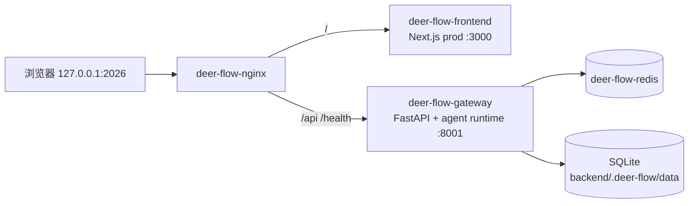

# DeerFlow 本机源码部署运维交接（RUYI-117）

本文记录 Owner 本机上从源码部署的 DeerFlow 生产栈的运行形态、运维入口、配置边界、
故障恢复与完整卸载路径。形态对标同机的 `~/srv/multica`：**源码检出直接作为部署目录**，
用仓库自带的 Docker Compose 生产栈运行。

## 1. 拓扑与目录边界

| 角色 | 路径 | Git 形态 | 说明 |
| --- | --- | --- | --- |
| 部署目录 | `/home/guxy/srv/deerflow` | detached HEAD | 只用于运行；不在此开发、不提交。**自带全部运维入口与本文档** |
| 源码 worktree | `/mnt/data/Codes/offcial/worktrees/RUYI-117` | 分支 `feature/ruyi-117-deerflow-local-deploy` | 本单开发与本地 commit 位置 |
| 共享检出 | `/mnt/data/Codes/offcial/deer-flow` | 分支 `main` | 只读参照，不参与本部署 |

三者共享同一 `.git`（`git worktree`），部署目录的基线切换用 `git -C /home/guxy/srv/deerflow checkout <sha>` 即可，无需重新 clone。

**部署目录自包含**：运维脚本与本文档都是部署目录检出内容的一部分，从脚本自身位置推导部署目录。
删除或迁移任何开发 worktree 都不影响部署目录的可管理性。



## 2. 运维入口

统一入口：**部署目录内**的 `scripts/deerflow-local-ops.sh`。它包装仓库既有 `scripts/deploy.sh`，
并把每次操作的原始输出归档到 `<部署目录>/backend/.deer-flow/local-ops/logs/`。

```bash
cd /home/guxy/srv/deerflow

./scripts/deerflow-local-ops.sh up        # 构建镜像并启动（首次部署 / 基线变更后）
./scripts/deerflow-local-ops.sh start     # 不重建直接启动（日常启动、重启恢复）
./scripts/deerflow-local-ops.sh down      # 停止并移除容器（保留数据）
./scripts/deerflow-local-ops.sh restart
./scripts/deerflow-local-ops.sh status    # 容器 / 端口 / 资源 / 卷
./scripts/deerflow-local-ops.sh health    # 健康探针
./scripts/deerflow-local-ops.sh logs      # 跟随网关日志
./scripts/deerflow-local-ops.sh uninstall # 完整卸载（二次确认）
```

部署目录由脚本自身位置推导，无需任何外部路径变量；`DEERFLOW_DEPLOY_DIR` 仅在跨目录调用时才需要覆盖。
对外入口地址跟随 `.env` 中的 `PORT` 自动推导，改端口后 `health` 探针无需同步改脚本。

等价的仓库原生入口（同样在部署目录内执行）：`make up` / `make down` / `bash scripts/deploy.sh start`。

**开机自启**：未配置 systemd unit，依赖 Docker 自身：`systemctl is-enabled docker` = `enabled`，
四个容器的 `RestartPolicy` 均为 `unless-stopped`，因此宿主重启后预期自动拉起（未做宿主重启实测）。
若此前执行过 `down`（容器被移除），宿主重启不会恢复，需手动执行一次 `start`。

## 3. 端口与资源

| 项 | 值 |
| --- | --- |
| 对外入口 | `http://127.0.0.1:2026`（仅 loopback，未暴露到局域网） |
| 内部端口 | frontend 3000、gateway 8001、redis 6379（均不映射到宿主） |
| 容器 | `deer-flow-nginx` / `deer-flow-gateway` / `deer-flow-frontend` / `deer-flow-redis` |
| compose 项目名 | `deer-flow` |
| 内存占用 | 合计约 370 MiB（gateway ~270、frontend ~89、redis ~8、nginx ~3） |
| 镜像 | `deer-flow-gateway:latest` 1.26 GB、`deer-flow-frontend:latest` 1.33 GB |
| 部署目录 | 59 MB |

## 4. 数据与持久化

| 数据 | 位置 | 备份方式 |
| --- | --- | --- |
| 业务库（账户、会话、消息） | `<部署目录>/backend/.deer-flow/data/deerflow.db`（SQLite） | 停机后直接复制该目录 |
| 记忆检索索引 | `<部署目录>/backend/.deer-flow/.retrieval/memory-fts5.sqlite3` | 同上，可重建 |
| Redis | docker volume `deer-flow_redis-data`（appendonly） | `docker run --rm -v deer-flow_redis-data:/d -v $PWD:/b alpine tar czf /b/redis.tgz -C /d .` |

数据落在宿主目录与命名卷上，`down` / `restart` / 宿主重启均不丢数据。

## 5. 配置与秘密边界

| 文件 | 是否入 Git | 内容 |
| --- | --- | --- |
| `config.example.yaml` | 是 | 模板，只含变量名占位符 |
| `<部署目录>/config.yaml` | 否（`.gitignore` 第 33 行） | 模型与工具配置；密钥位置只写 `$DEEPSEEK_API_KEY` 这类占位符 |
| `.env.example` | 是 | 模板 |
| `<部署目录>/.env` | 否（`.gitignore` 第 30 行） | 实际密钥值的唯一注入点 |
| `<部署目录>/frontend/.env` | 否 | 由 `frontend/.env.example` 直接复制 |
| `<部署目录>/backend/.deer-flow/local-ops/secrets/` | 否（`.gitignore` 第 44 行 `.deer-flow/`） | 管理员账号与 cookie，目录 `700`、文件 `600` |
| `<部署目录>/backend/.deer-flow/local-ops/logs/` | 否（同上） | 运维与构建日志 |

**部署目录本身是该仓库的一个 `git worktree`**，因此「放在部署目录内」不等于「在仓库之外」。
所有本地凭据与运维产物一律放在 `backend/.deer-flow/`（即 `DEER_FLOW_HOME`）之下——这是 DeerFlow
项目既有的本地数据边界，被 `.gitignore` 的 `.deer-flow/` 规则整体覆盖，不会被 `git add -A` 纳入
候选提交。**禁止把凭据写在部署目录根下的自建目录**（那类路径不受任何 ignore 规则保护）。

秘密只经 gitignored 的 `.env` 注入；`config.yaml` 全程只保留 `$VAR` 占位符，
不写入 Git、Issue、命令行参数或日志。

本次部署实际启用：

- 模型：`deepseek-v4-pro` / `deepseek-v4-flash`（凭据 `$DEEPSEEK_API_KEY`）
- 搜索后端：Exa（`deerflow.community.exa.tools:web_search_tool`，凭据 `$EXA_API_KEY`）。
  原默认 DuckDuckGo 在本机出网 30 s 超时，配置以注释形式保留，网络恢复后可一行切回。

构建期镜像源约定（写在 `.env`）：

- `NPM_REGISTRY=https://registry.npmmirror.com` — 前端 pnpm 走国内源，必要。
- `UV_INDEX_URL` **必须留空**。设置 pypi 镜像会让 `uv` 把 `backend/uv.lock` 中 250 个包的
  `registry` 与 `files.pythonhosted.org` URL 重写为镜像地址，导致 `uv sync --locked` 校验
  失败。本机 PyPI 直连可用，无需镜像。

## 6. 健康探针

```bash
curl -fsS http://127.0.0.1:2026/health
# {"status":"healthy","service":"deer-flow-gateway"}
curl -fsS http://127.0.0.1:2026/health/ready
# {"status":"ready","service":"deer-flow-gateway","database":"ok","checkpointer":"ok"}
```

两个探针由 nginx 独立 `location /health` 转发，**无需认证**。
注意 `/api/health` 走认证链会返回 401，不是健康判据。

## 7. 首次初始化与验证

1. `POST /api/v1/auth/initialize` 创建管理员。邮箱域名不能用 `localhost.local` 等保留域
   （pydantic email 校验会 422），本次用 `admin@deerflow.local.dev`。
2. 写接口受 CSRF 双提交保护：需同时带 `csrf_token` cookie 与 `X-CSRF-Token` 请求头。
3. 真实任务验证走 LangGraph 兼容 API：`POST /api/threads` → `POST /api/threads/{tid}/runs/wait`
   → `GET /api/threads/{tid}/state`。判据是 AI **实际发起了 `web_search` 工具调用并返回带引用的答案**，
   HTTP 200 不作为验收证据。

## 8. 故障恢复

| 现象 | 处置 |
| --- | --- |
| 构建时基础镜像 `DeadlineExceeded` | 逐个 `docker pull python:3.12-slim-bookworm`、`ghcr.io/astral-sh/uv:0.11.1`、`docker:cli`、`node:22-alpine`、`redis:7-alpine` 预拉后重试；并发拉取才会超时 |
| `uv sync --locked` 报 lockfile needs update | 检查 `.env` 是否设了 `UV_INDEX_URL`，注释掉后重建；若 `uv.lock` 已被改写，用 `git checkout -- backend/uv.lock` 还原 |
| gateway unhealthy | `./scripts/deerflow-local-ops.sh logs` 看网关日志；确认 `.env` 中模型凭据存在 |
| 搜索工具超时 | 切换 `config.yaml` 中 `web_search` 的 `use:` 到可用后端 |
| 端口 2026 被占 | `.env` 中改 `PORT`，再 `./scripts/deerflow-local-ops.sh restart`（探针地址自动跟随） |
| 数据疑似损坏 | `down` 后备份 `backend/.deer-flow/data`，再排查 |

## 9. 完整卸载 / 回退

```bash
cd /home/guxy/srv/deerflow
./scripts/deerflow-local-ops.sh uninstall           # 容器 + redis 卷 + 本部署镜像
rm -rf /home/guxy/srv/deerflow/backend/.deer-flow   # 可选：清业务数据、运维日志与本地凭据
git -C /mnt/data/Codes/offcial/deer-flow worktree remove --force /home/guxy/srv/deerflow
```

回退或切换源码基线（不卸载）：

```bash
git -C /home/guxy/srv/deerflow checkout <目标-sha>
cd /home/guxy/srv/deerflow && ./scripts/deerflow-local-ops.sh up   # 基线变了必须重建镜像
```

切换基线时脚本与本文档随检出内容一起变化，因此目标基线必须已包含它们；
若切到不含本单交付的基线，运维入口会退回仓库原生的 `make up` / `scripts/deploy.sh`。

## 10. 未覆盖项

- 无开机自启（systemd unit）配置。
- 未配置 HTTPS / 对外暴露；仅 loopback 访问。
- 未做备份定时任务与日志轮转。
- Sandbox 使用默认 `LocalSandboxProvider`（`allow_host_bash: false`），未启用 Docker-outside-of-Docker。
